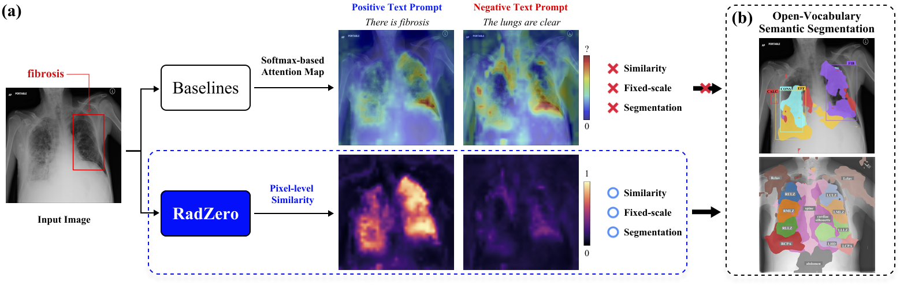
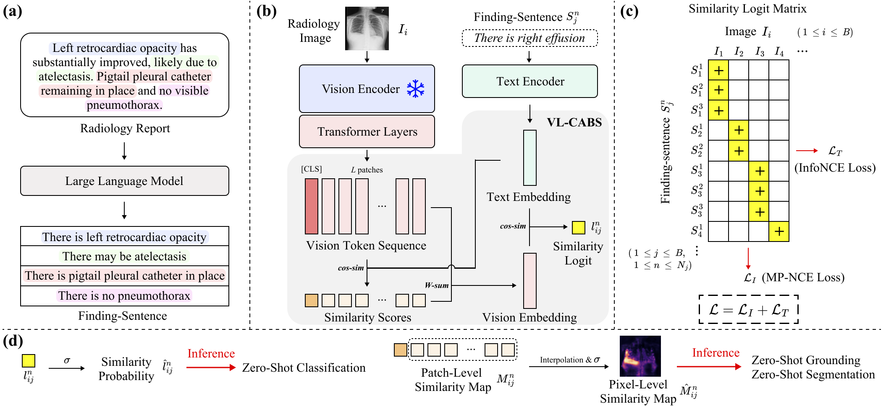

<div align="center">
    
# RadZero: Similarity-Based Cross-Attention for Explainable Vision-Language Alignment in Chest X-ray with Zero-Shot Multi-Task Capability [NeurIPS 2025]


<p align="center">
📝 <a href="https://arxiv.org/abs/2504.07416" target="_blank">Paper</a> • 🤗 <a href="https://huggingface.co/Deepnoid/RadZero" target="_blank">Model</a> • 🧩 <a href="https://github.com/deepnoid-ai/RadZero" target="_blank">Codes</a>
</p>

</div>

## Introduction 

<p align="center">
  
</p>
<p align="center">
  <em>Figure 1. Comparison of attention maps and the proposed VL similarity map for visualizing VL
alignment. (a) While traditional attention maps inevitably exhibit high values at certain points due to softmax activation, the proposed VL similarity maps yield low values for unrelated image-text pair. (b) Their fixed scale, originating from cosine similarity, enables open-vocabulary semantic segmentation through simple thresholding.</em>
</p>

<p align="center">
  

</p>
<p align="center">
  <em>Figure 2. Overview of the RadZero framework. Finding-sentences are extracted from reports and aligned with local image patch features through similarity-based cross-attention (VL-CABS), enabling zero-shot classification, grounding, and segmentation.</em>
</p>


## Abstract

> Recent advancements in multimodal models have significantly improved vision-language (VL) alignment in radiology. However, existing approaches struggle to effectively utilize complex radiology reports for learning and offer limited interpretability through attention probability visualizations. To address these challenges, we introduce RadZero, a novel framework for VL alignment in chest X-ray with zero-shot multi-task capability. A key component of our approach is VL-CABS (Vision-Language Cross-Attention Based on Similarity), which aligns text embeddings with local image features for interpretable, fine-grained VL reasoning. RadZero leverages large language models to extract concise semantic sentences from radiology reports and employs multi-positive contrastive training to effectively capture relationships between images and multiple relevant textual descriptions. It uses a pre-trained vision encoder with additional trainable Transformer layers, allowing efficient high-resolution image processing. By computing similarity between text embeddings and local image patch features, VL-CABS enables zero-shot inference with similarity probability for classification, and pixel-level VL similarity maps for grounding and segmentation. Experimental results on public chest radiograph benchmarks show that RadZero outperforms state-of-the-art methods in zero-shot classification, grounding, and segmentation. Furthermore, VL similarity map analysis highlights the potential of VL-CABS for improving explainability in VL alignment. Additionally, qualitative evaluation demonstrates RadZero's capability for open-vocabulary semantic segmentation, further validating its effectiveness in medical imaging. 


## Updates
- `2024-11-23`: Code and model checkpoints of RadZero have been released. 🚀
- `2025-10-19`: **RadZero3D** (an extension of RadZero to Chest CT) has been published at the [ICCV 2025 VLM3D Workshop](https://vlm3dchallenge.com/workshop/)! 🎉 You can read the paper [here](https://openaccess.thecvf.com/content/ICCV2025W/VLM3D/papers/Park_RadZero3D_Bridging_Self-Supervised_Video_Models_and_Medical_Vision-Language_Alignment_for_ICCVW_2025_paper.pdf).
- `2025-09-18`: **RadZero** has been accepted to NeurIPS 2025! 🎉 (5,290 / 21,575 = 24.52% acceptance rate)


## RadZero Model Inference

### Install dependencies

```
pip install -r requirements.txt
```

### Model Inference Codes

RadZero can perform **zero-shot classification / grounding / segmentation for chest X-ray** 
using the **RadZero model** on 🤗 <a href="https://huggingface.co/Deepnoid/RadZero" target="_blank">Hugging Face</a>.


```python
import warnings

import torch
from transformers import AutoImageProcessor, AutoModel, AutoTokenizer

from utils import model_inference

# Suppress specific warnings for cleaner logs
warnings.filterwarnings("ignore", category=UserWarning)


def load_model(device, dtype):

    tokenizer = AutoTokenizer.from_pretrained("Deepnoid/RadZero")
    image_processor = AutoImageProcessor.from_pretrained("Deepnoid/RadZero")

    model = AutoModel.from_pretrained(
        "Deepnoid/RadZero",
        trust_remote_code=True,
        torch_dtype=dtype,
        device_map=device,
    )

    models = {
        "tokenizer": tokenizer,
        "image_processor": image_processor,
        "model": model,
    }
    return models


if __name__ == "__main__":
    # Setup constant
    device = torch.device("cuda")
    dtype = torch.float32

    # load models
    models = load_model(device, dtype)

    # load image
    image_path = "cxr_image.jpg"

    # inference
    similarity_prob, similarity_map = model_inference(
        image_path, "There is fibrosis", **models
    )

    print(similarity_prob)
    print(similarity_map.min())
    print(similarity_map.max())
    print(similarity_map.shape)
```


## Training

### Download dataset

- **MIMIC-CXR (preprocessed JSON used in RadZero)**  
  - Hugging Face: [`Deepnoid/RadZero` – `data/MIMIC-CXR`](https://huggingface.co/Deepnoid/RadZero/tree/main/data/MIMIC-CXR)

### Run Command
1. Set the appropriate data and output paths for your environment in `exp/cxr_pt/configs/paths.yaml`.

Make sure to update these fields to reflect where your dataset is stored and where experiment outputs should be saved.

2. Use the command below to start training the RadZero model.

```
cd RadZero
PYTHONPATH=. torchrun --nproc_per_node=4 --nnodes=1 exp/cxr_pt/run.py --add_cfg_list radzero paths
```

## References

- **Dataset**
  - [MIMIC-CXR](https://physionet.org/content/mimic-cxr/2.1.0/)

- **Zero-shot evaluation**
  - [CARZero (CVPR 2024)](https://github.com/laihaoran/CARZero)

- **Pretrained models**
  - **Vision encoder**: [XrayDINOv2](https://huggingface.co/StanfordAIMI/dinov2-base-xray-224)
  - **Text encoder**: [all-mpnet-base-v2](https://huggingface.co/sentence-transformers/all-mpnet-base-v2)

- **Finetuning baseline**
  - [MGCA (NeurIPS 2022)](https://github.com/HKU-MedAI/MGCA)


## Acknowledgments
This work was supported by the Technology Innovation Program (RS-2025-02221011, Development
of Medical-Specialized Multimodal Hyperscale Generative AI Technology for Global Integration)
funded by the Ministry of Trade Industry & Energy (MOTIE, South Korea).


## LICENSE
[](https://creativecommons.org/licenses/by-nc/4.0/)

